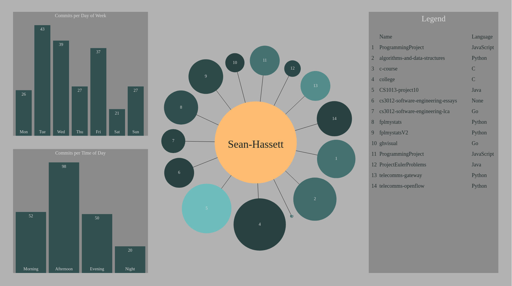

# GHVisual

## Introduction



View data about the activity of a GitHub User.

The centre circle represents the User with each of the circles branching out from the User representing a repository that they own.
The size of the circle scales with the size of the repo. The color of the circle is determined by how recently the repo was updated. Repos which haven't been updated in a long time will be a lighter shade while repos which have been updated in the past few days will be dark.

To the left are two bar charts.
The top chart shows the breakdown of all a User's commits based on the day of the week the commit was made.
The bottom chart shows a breakdown based on the time of day the commit was made.
The intent is to reveal patterns in a User's activity around the day of the week and the time of day. 

For time of day, the definitions are as follows:
* Morning: 6:00am - 11:59am
* Afternoon: 12:00pm - 5:59pm
* Evening: 6:00pm - 11:59pm
* Night: 12:00am - 5:59am

The data is fetched live so it will be up to date but only public repositories and commit history can be accessed.
It is possible to include the data from private activity if your access token has access to your private repositories but it's a little awkward.
You need to change line 61 of ghvisual/retrieve.go from:
```
repos, _, err := client.Repositories.List(ctx, config.Username, nil)
```
to:
```
repos, _, err := client.Repositories.List(ctx, "", nil)
```

This means it will default to the User that the access token is associated with and will include private activity if the token has access.
Changing the Username in the config to an empty string won't work since that value is used in other places and  setting the Username to the account that the token is associated with won't pull in private activity even if the token has access to it so for now the awkward solution is the only one.

## Install & Run

#### 1. Docker

##### Prerequisites:

* [Docker](https://www.docker.com/get-started)
* [Github Personal Access Token](https://help.github.com/articles/creating-a-personal-access-token-for-the-command-line/)

##### Steps

* Clone the repo.
* Open the file:
```
ghvisual/config/config.json
```
* Enter your access token and the username you want to look at.
* To build and run the Docker image enter the following commands with sudo privileges:

```
bash docker_build.sh
bash docker_run.sh
``` 
* With the container running, navigate to localhost:8080 in your browser to see the program.

#### 2. No Docker

##### Prerequisites:

* [Golang](https://golang.org/doc/install)
* [Govendor](https://github.com/kardianos/govendor)
* [Github Personal Access Token](https://help.github.com/articles/creating-a-personal-access-token-for-the-command-line/)

##### Steps

* Clone the repo and make sure the cloned repo is in your GOPATH (which is usually set to $HOME/go).
* Open the file:
```
ghvisual/config/config.json
```
* Enter your access token and the username you want to look at.
* From the root directory run:
```
govendor sync
```
* This will install the dependencies. You will have to ensure your GOPATH and PATH environment variables are set up correctly. If govendor isn't working for you, enter the following commands before trying govendor again:
```
export GOPATH=$HOME/go
export PATH=$PATH:$GOPATH/bin
```
* Execute the run script from the root directory:
```
bash run.sh
```
* Navigate to localhost:8080 in your browser to see the program.